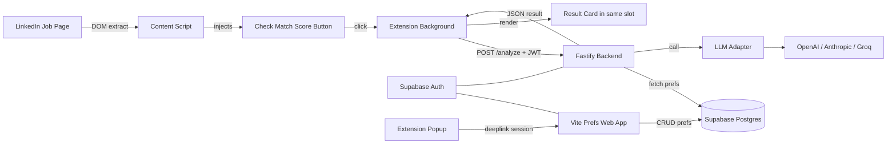
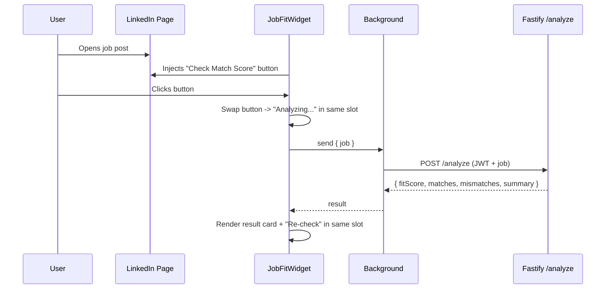

## Architecture

No job descriptions or scores are persisted. Only user preferences + auth live in Supabase.

## Why no Next.js

- The only server-side need is hiding the LLM API key + verifying the Supabase JWT -> a single Fastify endpoint covers it.
- Prefs UI is a small form; a plain Vite + React SPA is lighter and avoids SSR complexity we don't need.
- Supabase JS handles auth + DB on the client, so the backend stays a dumb LLM proxy.

## Repo Layout (pnpm workspaces)

- `apps/extension/` - Plasmo + React + TypeScript (content script, button/result UI, popup, background)
- `apps/backend/` - Fastify + TypeScript, single `POST /analyze` endpoint
- `apps/web/` - Vite + React + TypeScript + Tailwind + shadcn/ui, Supabase auth + prefs form
- `packages/shared/` - Shared TS types (`AnalyzeRequest`, `AnalyzeResult`, `UserPreferences`) + prompt builder
- `packages/llm/` - Provider-agnostic LLM adapter

## Key Modules

### LLM Adapter - `packages/llm/src/index.ts`

- `interface LlmClient { complete<T>(opts: { system: string; user: string; schema: ZodSchema<T>; temperature?: number }): Promise<T> }`
- Implementations: `OpenAIClient`, `AnthropicClient`, `GroqClient` (selected by `LLM_PROVIDER` env var).
- Each uses its native structured-output / JSON mode; validate with Zod before returning.

### Prompt Builder - `packages/shared/src/prompt.ts`

- System prompt locks: strict JSON only, temp 0.2, no hallucination, rubric weights (Skills 40 / Experience 20 / Location+WorkMode 20 / Role 20).
- Takes `{ job, userPreferences }`, returns `{ system, user }`.
- Truncates `job.description` to ~3k tokens on the client before sending.

### Backend - `apps/backend/src/server.ts`

- Fastify app, CORS restricted to the extension origin + the web app origin.
- `POST /analyze`:
  1. Verify `Authorization: Bearer <supabase-jwt>` via Supabase JWKS.
  2. `select * from user_preferences where user_id = :sub`.
  3. Call `llm.complete({ system, user, schema: AnalyzeResultSchema, temperature: 0.2 })`.
  4. Return the validated JSON. Nothing persisted.

### Preferences Web App - `apps/web/`

- Stack: Vite + React + TS + Tailwind + shadcn/ui. At implementation time the `shadcn` skill is loaded for correct setup (`components.json`, CLI, install patterns).
- `src/pages/Login.tsx` - Supabase magic link (shadcn `Card` + `Input` + `Button`).
- `src/pages/Preferences.tsx` - form per PRD: experienceYears, roles[], techStack[], locations[], workType (remote/hybrid/onsite), minSalary, dealBreakers[]. Uses shadcn `Form`, `Input`, `Select`, `Badge`, `Switch`, `Textarea`. Upserts into `user_preferences`.
- `src/pages/ConnectExtension.tsx` - on login, exposes a short-lived session token via `postMessage` + deeplink back to the extension.

### Extension - `apps/extension/`

- `content.ts`: runs on `https://www.linkedin.com/jobs/*`. MutationObserver watches for the job panel, extracts `jobTitle`, `companyName`, `location`, `description` with a resilient selector stack (data-testid -> aria-label -> class name fallbacks). Debounced 400 ms.
- `JobFitWidget.tsx` (injected React root mounted into a dedicated slot in the job panel):
  - **Idle**: `[Check Match Score]` button + 1-line hint.
  - **Loading**: button replaced by skeleton ("Analyzing..." with a spinner) in the same container.
  - **Result**: same container renders big colored score, Matches list, Concerns list, 1-line summary, and a small `Re-check` button.
  - **Error**: inline error + `Retry` button.
  - On LinkedIn SPA navigation (job change) the widget resets to **Idle**.
- `background.ts`: stores **only** the Supabase session (access_token + refresh_token) in `chrome.storage.local`, signs requests with the JWT, forwards the extracted job payload to the backend. No prefs are ever stored in the extension - the backend reads them from Supabase on every `/analyze` call.
- `popup.tsx`: shows login state; "Open preferences" opens the web app; "Sign out" clears session.

## Data Model (Supabase)

- `user_preferences` (`user_id` PK/FK to `auth.users`, `experience_years` int, `roles` text[], `tech_stack` text[], `locations` text[], `work_type` text[], `min_salary` text, `deal_breakers` text[], `updated_at` timestamptz). RLS: users can only read/write their own row.
- No jobs/scores tables.

## UI Flow (updated per request)

## Latency Plan

- Default provider: fast-tier model (e.g. gpt-4o-mini / claude-haiku / llama-3.1-8b on Groq).
- Client-side truncation of description before network call.
- Backend may cache prefs per `user_id` in-memory for ~60s (TTL) to avoid refetching on rapid re-checks; invalidated on signed-out token.
- Target < 2s perceived: button -> "Analyzing..." state is instant; result replaces it on response.
- Streaming left as v1.1 (flag in adapter interface, not wired into UI initially).

## Risks / Mitigations (from PRD)

- LinkedIn DOM churn -> selector fallback chain + integration test fixtures in `apps/extension/tests/fixtures/`.
- Garbage-in descriptions -> prompt includes "ignore boilerplate / legal / EEO sections".
- Score feels arbitrary -> render rubric weights alongside score in a tooltip.
- Provider lock-in -> adapter interface + Zod validation layer.

## Build Order + Verification Checkpoints

Each phase ends with a concrete, runnable check you can perform before we continue. I will stop after each checkpoint and hand it to you to verify.

**Phase 1 - Monorepo + shared types**

- Do: pnpm workspaces, TS config, shared package with `AnalyzeRequest` / `AnalyzeResult` / `UserPreferences` + Zod schemas.
- Verify: `pnpm -r build` succeeds; `pnpm --filter shared test` (one tiny Zod round-trip test) passes.

**Phase 2 - LLM adapter**

- Do: `packages/llm` with OpenAI + Anthropic + Groq implementations + Zod validation.
- Verify: `pnpm --filter llm exec tsx scripts/smoke.ts` - a CLI script that reads `LLM_PROVIDER` from env and prints a JSON `AnalyzeResult` from a hardcoded sample. You try at least one provider end-to-end.

**Phase 3 - Supabase schema + auth**

- Do: create Supabase project, `user_preferences` table, RLS policies, get JWKS URL.
- Verify: SQL check in Supabase dashboard confirms table + policies; a tiny script (`scripts/verify-rls.ts`) logs in as two test users and asserts each only sees their own row.

**Phase 4 - Fastify `/analyze`**

- Do: endpoint with JWT verify, prefs fetch, prompt build, LLM call, Zod validation.
- Verify: `curl -X POST http://localhost:3000/analyze -H "Authorization: Bearer <jwt>" -d @sample-job.json` returns a valid `AnalyzeResult`. 401 with no token. I will include `sample-job.json` and a short README block with the exact commands.

**Phase 5 - Prefs web app (Vite + shadcn)**

- Do: login, prefs form, save to Supabase.
- Verify: Open `http://localhost:5173`, magic-link in, fill form, save, reload -> values persist. Check row in Supabase SQL editor.

**Phase 6 - Extension scaffold + DOM extraction**

- Do: Plasmo project, content script, MutationObserver, selector fallback chain. Debug output logged to console.
- Verify: Load unpacked extension, open 3 different LinkedIn jobs, DevTools console shows correctly extracted `{ jobTitle, companyName, location, description }` for each.

**Phase 7 - `Check Match Score` button UI**

- Do: inject widget with idle/loading/result/error states into the job panel; hit a mocked `/analyze` that returns a fixture.
- Verify: Button visible on LinkedIn job page; click -> Analyzing state -> result card populated with fixture data in the same container; `Re-check` returns to Analyzing.

**Phase 8 - Wire to real backend + auth handoff**

- Do: popup login deeplink -> web app -> postMessage session to background; background signs calls; real `/analyze` integration.
- Verify: Sign in via popup, open a LinkedIn job, click `Check Match Score` -> real score/matches/concerns appear within ~2s. Unauthed state shows a `Sign in` CTA in the widget.

**Phase 9 - Hardening**

- Do: DOM fixture tests for selectors, error surfaces for LLM/Supabase failures, CORS tightening.
- Verify: `pnpm --filter extension test` passes against 3+ saved LinkedIn HTML fixtures; manually test with no network / invalid token / empty prefs.

**Phase 10 - README + packaging**

- Do: env var reference, local dev steps, Supabase provisioning, `load unpacked` instructions, build script for zip.
- Verify: Fresh clone + README walkthrough results in a working extension without asking me any questions.

## Open items I'll assume unless you say otherwise

- Deployment: Fastify backend on Fly.io or Railway; Vite web app on Vercel/Netlify static; Supabase managed. Extension distributed as unpacked zip for v1 (no Web Store submission).
- Auth: email magic link via Supabase; extension receives session via web-app-initiated deeplink.
- Package manager: pnpm.
- Styling: Tailwind CSS in extension widget and web app.

